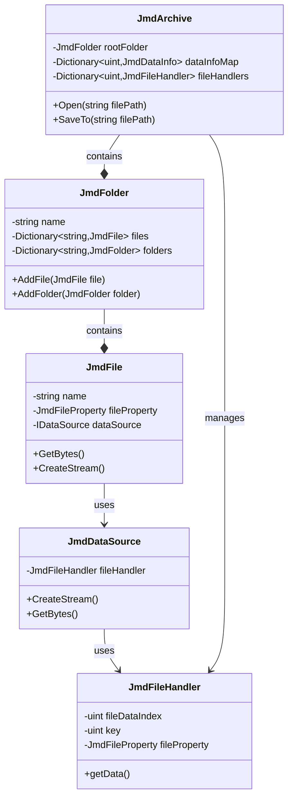

# 클래스 구조 및 관계

## 핵심 클래스 다이어그램



## 인터페이스 계층

### IDataSource
```
- CreateStream()
- WriteTo(Stream)
- WriteTo(byte[], offset, count)
- GetBytes()
```

### IJmdFile
```
- Parent: IJmdFolder
- Name: string
- FullName: string
- Size: int
- DataSource: IDataSource
```

### IJmdFolder
```
- Parent: IJmdFolder
- Name: string
- FullName: string
- Files: IReadOnlyCollection<JmdFile>
- Folders: IReadOnlyCollection<JmdFolder>
```

## 주요 클래스 설명

### JmdArchive
```
역할: JMD 파일 컨테이너 관리
책임:
- 파일 열기/저장
- 데이터 정보 관리
- 파일 핸들러 관리
- 디렉토리 구조 관리
```

### JmdFolder
```
역할: 디렉토리 구조 표현
책임:
- 하위 폴더/파일 관리
- 경로 정보 관리
- 데이터 인덱스 관리
```

### JmdFile
```
역할: 개별 파일 표현
책임:
- 파일 메타데이터 관리
- 데이터 소스 연결
- 스트림 생성/관리
```

### JmdFileHandler
```
역할: 파일 데이터 접근 제어
책임:
- 데이터 로드/캐시
- 암호화 키 관리
- 메모리 관리
```

### JmdDataSource
```
역할: 파일 데이터 소스 추상화
책임:
- 스트림 생성/관리
- 데이터 변환
- 버퍼 관리
```

## 의존성 관계

### 데이터 흐름
```
1. JmdArchive
   ↓ (데이터 정보/핸들러 관리)
2. JmdFolder/JmdFile
   ↓ (데이터 소스 연결)
3. JmdDataSource
   ↓ (데이터 접근 제어)
4. JmdFileHandler
   ↓ (실제 데이터 처리)
5. 원본 데이터
```

### 리소스 관리
```
1. JmdArchive
   - 파일 스트림 관리
   - 핸들러 풀 관리
   
2. JmdFileHandler
   - 데이터 캐시 관리
   - 메모리 할당/해제
   
3. JmdDataSource
   - 스트림 생성/해제
   - 버퍼 관리
``` 