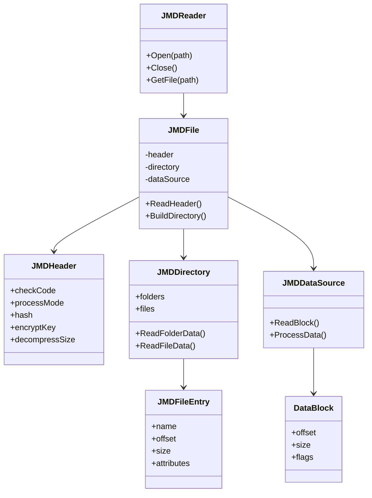

# 클래스 구조

## 핵심 클래스

## 클래스 설명

### JMDReader
- JMD 파일 처리 메인 클래스
- 파일 열기/닫기 관리
- 파일 데이터 접근 제공

### JMDFile
- JMD 파일 구조 표현
- 헤더/디렉토리/데이터 관리
- 파일 구조 구성 담당

### JMDHeader
- JMD 파일 헤더 정보
- 처리 모드/해시 관리
- 메타데이터 저장

### JMDDirectory
- 폴더/파일 구조 관리
- 데이터 인덱싱
- 파일 시스템 구성

### JMDFileEntry
- 개별 파일 정보
- 데이터 위치/크기
- 파일 속성 관리

### JMDDataSource
- 실제 데이터 접근
- 블록 단위 처리
- 데이터 변환 담당

### DataBlock
- 데이터 블록 정보
- 위치/크기 관리
- 처리 플래그 저장 