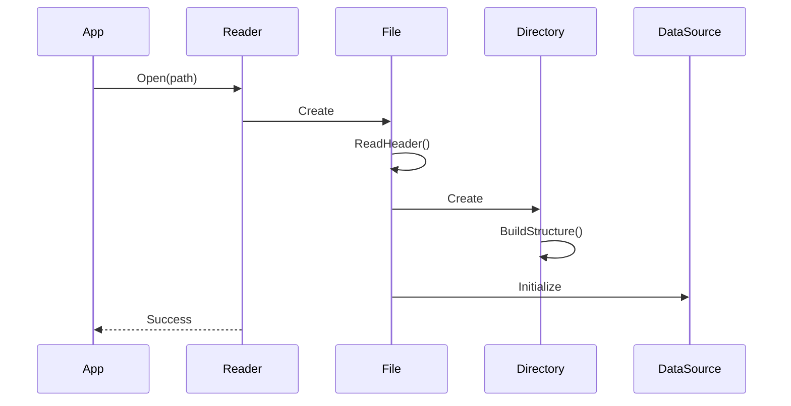
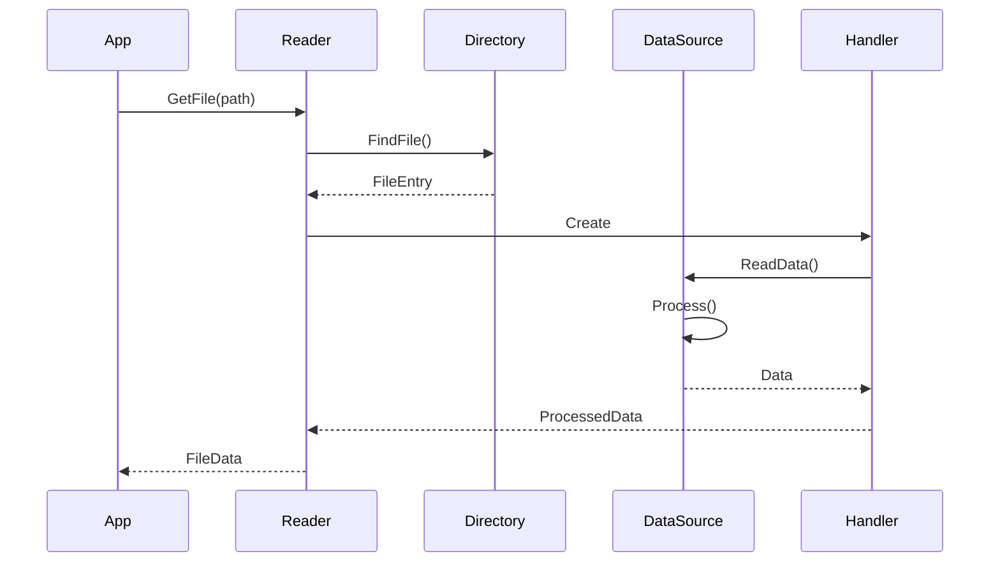
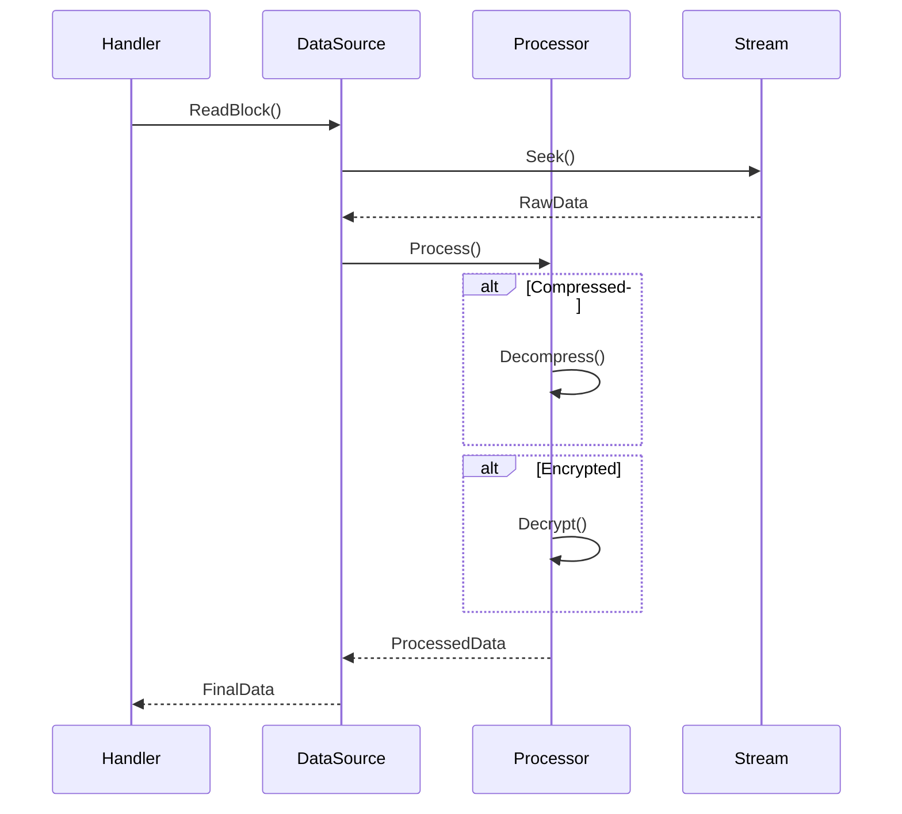
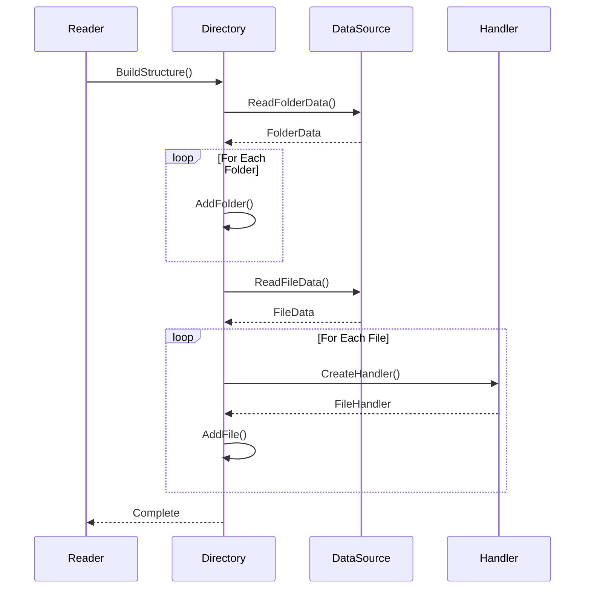
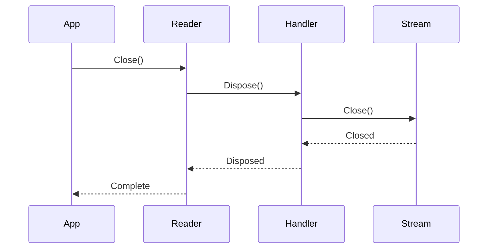

# 시퀀스 다이어그램

## 파일 열기 과정

```mermaid
sequenceDiagram
    participant App
    participant Reader
    participant File
    participant Directory
    participant DataSource
    
    App->>Reader: Open(path)
    Reader->>File: Create
    File->>File: ReadHeader()
    File->>Directory: Create
    Directory->>Directory: BuildStructure()
    File->>DataSource: Initialize
    Reader-->>App: Success
```

## 파일 읽기 과정

```mermaid
sequenceDiagram
    participant App
    participant Reader
    participant Directory
    participant DataSource
    participant Handler
    
    App->>Reader: GetFile(path)
    Reader->>Directory: FindFile()
    Directory-->>Reader: FileEntry
    Reader->>Handler: Create
    Handler->>DataSource: ReadData()
    DataSource->>DataSource: Process()
    DataSource-->>Handler: Data
    Handler-->>Reader: ProcessedData
    Reader-->>App: FileData
```

## 데이터 처리 과정

```mermaid
sequenceDiagram
    participant Handler
    participant DataSource
    participant Processor
    participant Stream
    
    Handler->>DataSource: ReadBlock()
    DataSource->>Stream: Seek()
    Stream-->>DataSource: RawData
    DataSource->>Processor: Process()
    
    alt Compressed
        Processor->>Processor: Decompress()
    end
    
    alt Encrypted
        Processor->>Processor: Decrypt()
    end
    
    Processor-->>DataSource: ProcessedData
    DataSource-->>Handler: FinalData
```

## 디렉토리 구성 과정

```mermaid
sequenceDiagram
    participant Reader
    participant Directory
    participant DataSource
    participant Handler
    
    Reader->>Directory: BuildStructure()
    Directory->>DataSource: ReadFolderData()
    DataSource-->>Directory: FolderData
    
    loop For Each Folder
        Directory->>Directory: AddFolder()
    end
    
    Directory->>DataSource: ReadFileData()
    DataSource-->>Directory: FileData
    
    loop For Each File
        Directory->>Handler: CreateHandler()
        Handler-->>Directory: FileHandler
        Directory->>Directory: AddFile()
    end
    
    Directory-->>Reader: Complete
```

## 리소스 관리 과정

```mermaid
sequenceDiagram
    participant App
    participant Reader
    participant Handler
    participant Stream
    
    App->>Reader: Close()
    Reader->>Handler: Dispose()
    Handler->>Stream: Close()
    Stream-->>Handler: Closed
    Handler-->>Reader: Disposed
    Reader-->>App: Complete
``` 