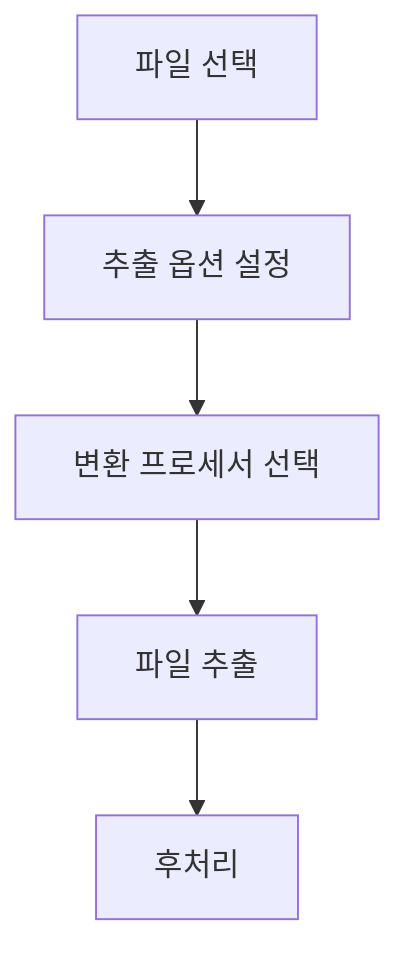

# 파일 추출 프로세스

## 개요
JMD 파일에서 개별 파일을 추출하는 프로세스 설명

## 추출 흐름도



## 추출 옵션
```
1. 기본 옵션
- 출력 경로 지정
- 상대 경로 유지
- 기존 파일 처리

2. 변환 옵션
- BML -> XML 변환
- KSV 처리
- 원본 유지
```

## 파일 변환

### BML 변환
```
1. BinaryXmlDocument 생성
2. UTF-16 인코딩으로 읽기
3. XML 형식으로 변환
4. UTF-8로 저장
```

### KSV 처리
```
1. 원본 데이터 유지
2. 추가 처리 없음
```

## 처리 과정

### 1. 초기화
```
1. 추출 대상 폴더 설정
2. 출력 경로 확인/생성
3. 변환 옵션 적용
```

### 2. 파일 처리
```
1. 상대 경로 계산
2. 출력 파일명 생성
3. 변환 프로세서 선택
4. 데이터 변환/저장
```

### 3. 진행 상황
```
1. 전체 파일 수 계산
2. 처리 진행률 표시
3. 에러 처리/로깅
``` 