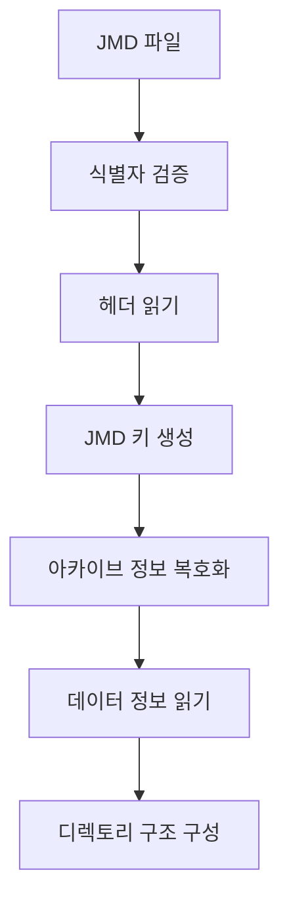
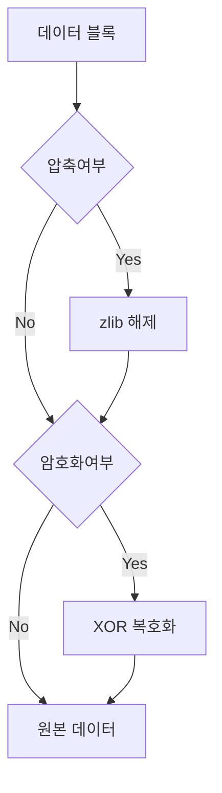
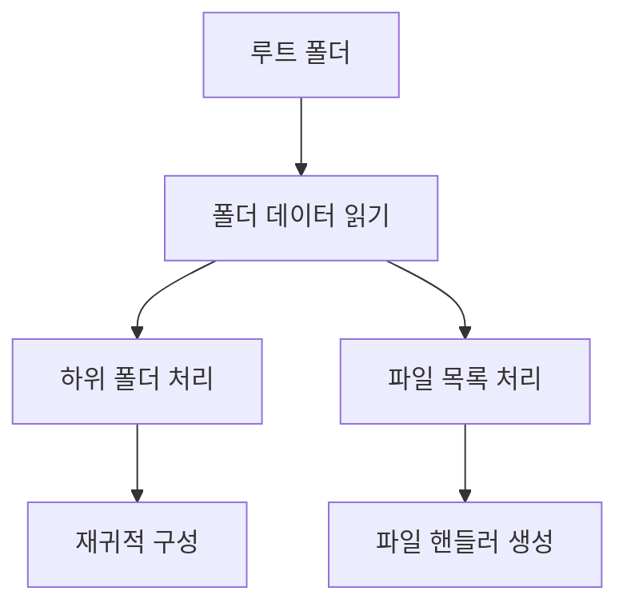
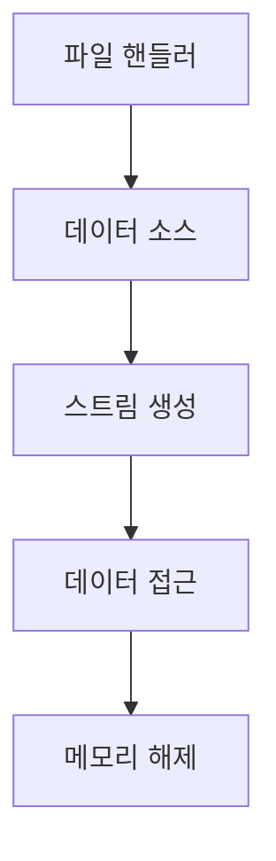

# JMD 데이터 처리 흐름

## 파일 열기 과정



### 1. 식별자 검증
```
1. 0x00-0x3F: 레이어 식별자 읽기
2. 0x40-0x7F: 보조 텍스트 읽기
3. 레이어 버전 확인
```

### 2. 헤더 처리
```
1. 0x80-0xFF: 헤더 데이터 읽기
2. 체크코드 (0x53) 확인
3. 처리 모드 플래그 확인
4. Adler32 해시 검증
```

### 3. 키 생성
```
1. 파일명에서 JMD 키 생성
2. 디렉토리 키 생성
3. 데이터 정보 키 생성
4. 파일별 키 생성
```

## 데이터 처리 과정



### 1. 데이터 블록 읽기
```
1. 데이터 정보에서 오프셋/크기 확인
2. 블록 속성 확인
3. 체크섬 검증
```

### 2. 압축 해제
```
1. zlib 스트림 생성
2. DEFLATE 데이터 처리
3. 압축 해제 크기 검증
```

### 3. 복호화
```
1. 키 준비 (파일/디렉토리)
2. XOR 복호화 수행
3. 부분 암호화시 분할 처리
```

## 디렉토리 구조 구성



### 1. 폴더 데이터
```
1. 폴더 수/파일 수 읽기
2. 폴더명/데이터 인덱스 읽기
3. 파일명/속성/크기 읽기
```

### 2. 파일 처리
```
1. 파일 핸들러 생성
2. 데이터 소스 연결
3. 파일 속성 설정
```

## 메모리 관리



### 1. 리소스 관리
```
1. 파일 핸들러 생성/해제
2. 스트림 관리
3. 버퍼 정리
```

### 2. 캐시 처리
```
1. 데이터 블록 캐싱
2. 메모리 정렬
3. 리소스 재사용
``` 