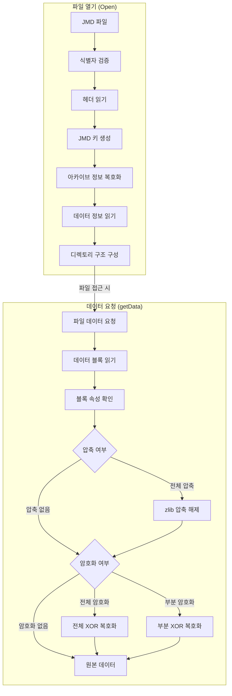
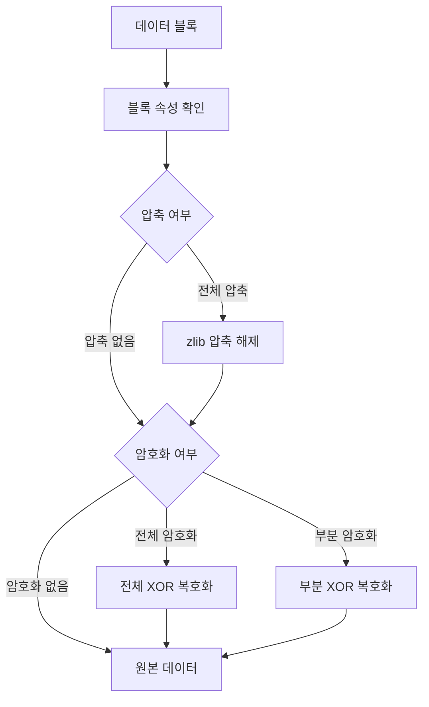

# JMD 파일 열기 과정

## 전체 처리 흐름도



## 데이터 블록 처리 흐름도



### 1. 식별자 검증
```
1. 0x00-0x3F: 레이어 식별자 읽기
2. 0x40-0x7F: 보조 텍스트 읽기
3. 레이어 버전 확인
```

### 2. 헤더 처리
```
1. 0x80-0xFF: 헤더 데이터 읽기
2. 체크코드 (0x53) 확인
3. 처리 모드 플래그 확인
4. Adler32 해시 검증
```

### 3. 키 생성
```
1. 파일명에서 JMD 키 생성 (Adler32 + 0x3de90dc3)
2. 아카이브 정보 키 생성 (JMD 키 ^ 0x3A9213AC)
3. 디렉토리 키 생성 (JMD 키 - 0x41014EBF)
4. 데이터 정보 키 생성
```

### 4. 아카이브 정보 복호화
```
1. 0x80-0xFF 영역 읽기
2. XOR 복호화 수행
3. 체크섬 검증
4. 데이터 정보 개수 확인
```

### 5. 데이터 정보 읽기
```
1. 0x100- 영역 읽기
2. 데이터 정보 복호화
3. 인덱스/오프셋/크기 확인
4. 블록 속성 확인
```

### 6. 디렉토리 구조 구성
```
1. 폴더 수/파일 수 읽기
2. 폴더명/데이터 인덱스 읽기
3. 파일명/속성/크기 읽기
4. 파일 핸들러 생성
5. 데이터 소스 연결
6. 파일 속성 설정
```

### 7. 데이터 블록 처리
```
1. 데이터 정보에서 오프셋/크기 확인
2. 블록 속성에 따라 처리:
   - 압축: zlib 스트림으로 압축 해제
   - 암호화: XOR 복호화 수행
3. 체크섬 검증
``` 