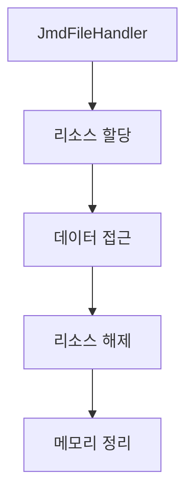

# JMD 파일 저장 과정

## 메모리 관리



### 1. 리소스 관리
```
1. JmdFileHandler
- 파일 데이터 접근 제어
- 암호화 키 관리
- 아카이브 참조 관리

2. JmdDataSource
- 데이터 스트림 생성/관리
- 버퍼 메모리 관리
- 파일 핸들러 참조
```

### 2. 데이터 접근
```
1. getData() 호출시
- 핸들러 유효성 검증
- 아카이브에서 데이터 로드
- 메모리 버퍼 관리

2. 스트림 생성시
- 메모리스트림 생성
- 읽기전용 접근 제어
```

### 3. 리소스 해제
```
1. Dispose 패턴
- 관리 리소스 해제
- 비관리 리소스 정리
- 중복 해제 방지

2. 참조 정리
- 핸들러 release
- 스트림 close
- 버퍼 정리
``` 