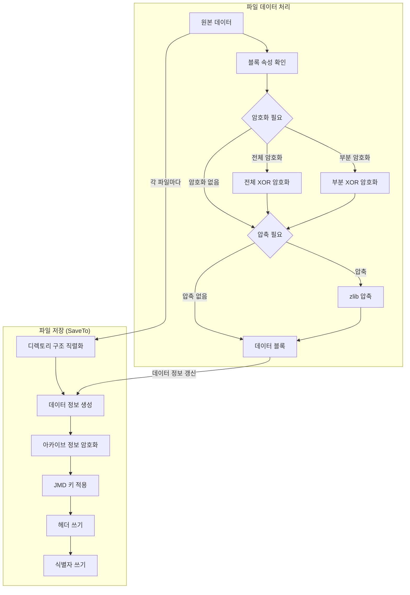
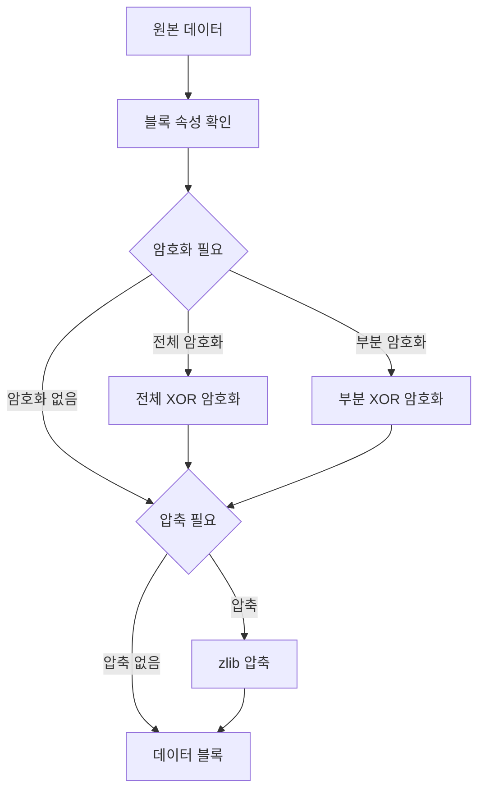
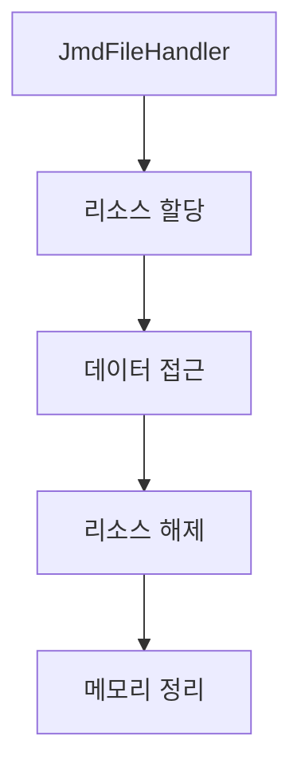

# JMD 파일 저장 과정

## 전체 처리 흐름도



## 데이터 블록 처리 흐름도



### 1. 디렉토리 구조 직렬화
```
1. 폴더 수/파일 수 기록
2. 폴더명/데이터 인덱스 기록
3. 파일명/속성/크기 기록
4. 파일 핸들러 생성
5. 데이터 소스 연결
6. 파일 속성 설정
```

### 2. 암호화
```
1. 키 준비 (파일/디렉토리)
2. XOR 암호화 수행
3. 부분 암호화시 분할 처리
```

### 3. 압축 처리
```
1. zlib 스트림 생성
2. DEFLATE 압축 수행
3. 압축 크기 기록
```

### 4. 데이터 블록 쓰기
```
1. 데이터 정보에 오프셋/크기 기록
2. 블록 속성 설정
3. 체크섬 생성
```

### 5. 키 적용
```
1. 파일명으로 JMD 키 적용
2. 디렉토리 키 적용
3. 데이터 정보 키 적용
4. 파일별 키 적용
```

### 6. 헤더 생성
```
1. 0x80-0xFF: 헤더 데이터 쓰기
2. 체크코드 (0x53) 삽입
3. 처리 모드 플래그 설정
4. Adler32 해시 생성
```

### 7. 식별자 쓰기
```
1. 0x00-0x3F: 레이어 식별자 쓰기
2. 0x40-0x7F: 보조 텍스트 쓰기
3. 레이어 버전 기록
```

## 메모리 관리



### 1. 리소스 관리
```
1. JmdFileHandler
- 파일 데이터 접근 제어
- 암호화 키 관리
- 아카이브 참조 관리

2. JmdDataSource
- 데이터 스트림 생성/관리
- 버퍼 메모리 관리
- 파일 핸들러 참조
```

### 2. 데이터 접근
```
1. getData() 호출시
- 핸들러 유효성 검증
- 아카이브에서 데이터 로드
- 메모리 버퍼 관리

2. 스트림 생성시
- 메모리스트림 생성
- 읽기전용 접근 제어
```

### 3. 리소스 해제
```
1. Dispose 패턴
- 관리 리소스 해제
- 비관리 리소스 정리
- 중복 해제 방지

2. 참조 정리
- 핸들러 release
- 스트림 close
- 버퍼 정리
``` 